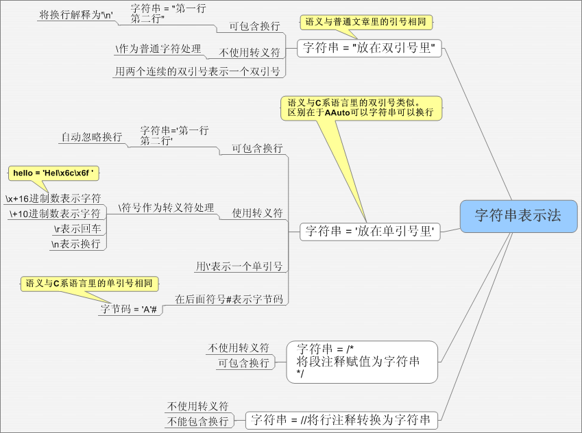

## **string(字符串** )

 计算机中以八个二进制位表示一个八位字节 - 这称为一个单字节字符。 一组连续的字节就构成一个字符串，在aardio中字符串是基于二进制的，可以包含任何数据（例如图像、文本、或者'\0'等不可打印字符）。

 字符串本质上是字节构成的数组，但这个数组是只读的，每次对字符串做替换、连接等操作都会生成新的字符串，
 每个字符串指向的内存不应该被直接修改。 下面的代码定义了一个最基本的字符串：

``` aau
var str ="C:\Documents and Settings\admin\Desktop\string.aardio"
```


 可以用
#str 取该字符串占用的内存字节长度，可以使用下标获取每个字节的数值，
 例如 str[1] 取出第一个字节的数值是67,
内存中的67在文本中显示出来的就是字符"C" -
这是ASCII编码规定的。

 前面说过，一个字节只有8个二进制位，那他能表示的字符就很有限，所以就有了很多不同的编码规则用多个字节
 来表示更多的字符，例如GBK,UTF-8等多字节字符集，用小于0x80的单字节表示ASCII字符（英文字母数字这些），
GBK用双字节表示汉字（首字符大于0x80)，而UTF8有两个以上的字节表示宽字符（所有字节大于0x7F).

GBK编码的第二个字节还是会与ASCII冲突，所以处理GBK字符串需要从头开始才能准确的检测一个字节属于谁，
 这导致容易出现串码问题，而UTF8的宽字符总是大于0x7F，首字符的两个二进制位总是1,而附加字节的前两个
 二进制位总是10，这就让我们处理文本非常方便，因为格式化的文本，例如HTML,JSON他的分隔标记通常都是
 固定小于0x7F的ASCII字符，但要注意UTF8的字符是变长的，理论一个字符可以是1，2，3，4
.....个字节。 不同的编码还存在不同的系统环境不兼容的问题，例如GBK的软件在繁体系统上就会乱码，而Unicode编码可以
 避免这一问题，Unicode编码有多种方案，主要被采用的则是UTF-8,UTF-16。
windows系统使用的是UTF-16,
 而 aardio 10开始，aardio的源代码文件、字符串等等默认使用UTF-8编码。 注意在aardio文档中一般提到Unicode指的是UTF 16.
 例如 string.fromUnicode()
string.toUnicode() 函数默认都是从UTF-8到 UTF-16(Unicode)双向转换。

### 一、文本字符串

文本字符串放在双引号中，字符串可以包含换行，aardio保证双引号中的字符串换行使用'\n'换行符,不包含'\r'回车符。

例如：

``` aau
strPath ="C:\Documents and Settings\admin\Desktop\string.aardio"
strLine ="第一行 第二行"
```

 如果在双引号中的字符串本身包含双引号，可以用两个连续的双引号表示双引号自身。

 另外在 aardio
10中，可以使用反引号（键盘左上角ESC下方的键）代替双引号，他们的作用与用法相同，、 例如：

###

``` aau
strPath = `C:\Documents and Settings\admin\Desktop\string.aardio`
strLine = `第一行 第二行`
```

aardio代码中双引号、反引号内的都是纯文本字符串，并被aardio标记为UTF-8编码。
aardio中每个字符串都有一个UTF格式标记，可以使用 string.getUtf() , string.setUtf() 函数获取或修改UTF标记。
UTF标记是按位设置的，utf & 8 表示一个UTF8编码的字符串，utf & 16表示一个UTF16编码的Unicode字符串。
而UTF & 1 表示一个ANSI字符串，用户在编写程序中一般不应去获取或修改该UTF标记，该格式标记应由aardio自动
维护，用于优化自动编码转换的效率。用户应当明确的了解一个文本的来源编码，并且有有需要时使用string.fromto()
等转换函数进行编码转换。aardio只要在能确认一个字符串的编码格式时才会对字符串进行标记（例如：直接写在aardio
源码中的字符串字面值，或者经过string.fromto函数成功转换编码的字符串）。

### 二、转义字符串

转义字符串放在单引号中。支持\转义符，语法与C\C++相同。 
需要注意的aardio中双引号中的字符串不能使用转义符，这一点与C语言有别。

在单引号中的字符串可以换行书写，但是aardio会忽略所有的换行，
aardio保证单引号中只能以'\r\n'表示回车换行符,所有字面值的回车换行被忽略 。
转义字符串支持的转义符与C,JS等类似：

|  转义符 |  说明 |
| \\ |  表示普通\字符 |
| \ddd |  用一到三个数字组成十进制数值表示一个字符 , 如果数值开始是数字0，将使用八进制表示一个字符， 如果只想表示'\0'后面有其他不相关的数字， 可以在\0后面加一个换行，例如 str ='\0 86' |
| \xAA |  用x后面的两位十六进制表示一个字符 |
| \uAAAA |  用u后面的4位十六进制表示一个Unicode字符， 可使用一对代理字符表示Unicode编码大于0x10000的4字节字符，例如：'\uD86E\uDC1C' 注意普通字符串里默认会解析为UTF-8编码的多字节字符， 而在Unicode字符串中解析为UTF-16编码的字符。 |
|
| \uAAAAAA | \U大写时， 可在其后跟随4个或6个十六进制字符表表示一个Unicode字符， 支持Unicode编码大于0x10000的4字节字符。 注意普通字符串里默认会解析为UTF-8编码的多字节字符，例如'\U02b81c' 而在Unicode字符串中解析为UTF-16编码的字符，例如'\U02b81c'u。 |
| \a |  响铃符(常用于print函数发出警告铃声，例如 io.print('\a') |
| \b |  退格 |
| \f |  换页 |
| \r |  回车 |
| \n |  换行 |
| \r\n |  回车换行 |
| \t |  制表符(横向跳格) |
| \v |  匹配一个垂直制表符。等价于 \x0b |
| \" |  双引号 |
| \' |  单引号 |
| \[ |  方括号[ |
| \] |  方括号] |

转义字符串可以换行、但是aardio会忽略换行符，必须使用\n表示换行、用\r\n表示回车换行。
如果单引号中仅包含一个字符、并且后面附加#号后缀、则表示该字符的字节码数值。

**示例：**

``` aau
io.open()

// 字符串中也可以直接用十六进制表示字符，例：
io.print('Hel\x6c\x6f world\x21'); //换行被忽略

//字符串也可以直用三位十进制数表示字符，例：
io.print('Hel\108\111 world\33')

//如果单引号中仅包含一个字符，并且在后面加上#号标记,则表示字符的ASCII值
io.print( 'A'# ) //显示65
```

 注意在转义符串结束后附加#符号表示字节码，附加U或u表示Unicode字符串（UTF16编码），例如：

``` aau
//用于在代码中输入UTF-16 LE编码字符串(代码页：1200)
var wstr = 'UTF16字符串'u

//UTF-8编码字符串(代码页：65001)
var utf8str = 'UTF8字符串'
```

Unicode字符串（UTF16编码）用下标取字节或字符时，返回的是双字节的值，例如

``` aau
import console; var wstr ='中文abc'u;for(i=1;#wstr/2;1){    console.log(wstr[ i ]) //宽字节码    console.log(wstr[[ i ]]) //宽字节字符}console.pause(true);
```

### 三、包含字符串

 包含字符串用于将一个文件直接嵌入aardio代码中，并加载为一个二进制字符串。 例如：

``` aau
var str = $"/test/test.jpg"
```


 在aardio程序编译发布以后，该文件就会直接被编译到aardio代码中，不再需要原来的文件也可以运行。

### 四、注释字符串

在aardio的赋值语句中，可以将行注释、段注释作为一个字符串组成赋值语句。
因为aardio中段注定可以自定义注释标记里 星号数目 - 只要首尾匹配就可以，这就可以方便的用来表示复杂的字符串。
而不用担心所包含的字符串里可能出现字符串的结束标记。

注释字符串的作用与双引号类似，表示的是纯文本字符串，aardio解析后会将起标记为UTF8编码，
但是段注释保证将换行解释为\r\n'，并且忽略首尾紧邻星号的第一个空行（如果有的话）,而行注释保证字符串没有回车符('\r')或换行符('\n')


请参考:[回车换行符](the%20language/datatype/line)

示例：

str = //表示原始单行字符串，到行尾结束;

str = /* 
表示原始多行字符串，首尾的*字符可以有一或多个，但*字符的数目必须首尾匹配
*/

### 附：字符串导航图 
