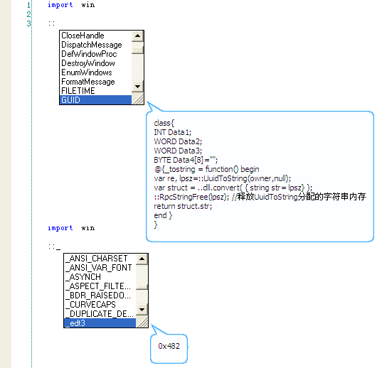

# 变量、常量

 变量、常量指代码中表示数据的对象，通常使用合法的标志符、字面值(数值、字符串)来表示。

## 变量

在程序运行过程中，用来存储数据值并且其`值能被改变的对象`称为变量。
变量的名称用字母、数字、中文字符、下划线等组成的合法标识符来表示。

变量名开始字符不能为数字。
变量名包含中文时，中文字符前面不能有字母或数字。
可以使用美元符号($)作为变量名或变量名的第一个字符。
可以使用下划线作为变量名或常量名的首字符,当下划线作为首字符时表示常量,单个下划线表示变量.

应遵循就近原则(Principle of Proximity):在第一次使用局部变量之前定义该变量，以使代码保持清晰的结构。


### 1、成员变量

成员变量是属于一个[名字空间](the%20language/namespace)的成员对象。
变量的默认名字空间为global名字空间，并可以使用namespace改变指定代码块的名字空间。
可以使用self关键字访问当前名字空间。使用..操作符访问global名字空间

``` aau
//没有用var语句显式声明的变量，默认就是当前名字空间的成员变量

变量 = "字符串:普通变量";
变量 = "变量的值是可以改变的"

..str = 123; //..str等价于 ..global.str
```

### 2、局部变量

var声明一个局部变量，作用域为当前语句块，以及被当前语句块所包含的语句块。
var语句声明的局部变量可以指定一个初始值，也可以不指定，建议对所有变量指定初始值。

例如：
``` aau
var 局部变量;
 局部变量 = 123;

var a,b,c = 1,2,3
io.print( a,b,c,局部变量 )
```

请参考：[var赋值语句](the%20language/statements/assignment#var) [函数局部变量](the%20language/function/definitions#var)


## 常量

在程序运行过程中，用来存储数据值并且其`值不能被改变的对象`称为常量，常量仅可初始化赋值一次，不可以修改其常量的值。


### 1、字面常量

指以数值、字符串等字面值表示数据的对象。
象123,"abc"这样的值被称之为字面值，被称为字面值是因为他的值就是代码直接描述的值，并且没有名字可以称呼他，只能用他的值来表示。


常量只能赋值一次，重复赋于相同的数字或字符串等常量值将会被忽略，赋于不同的值将会抛出错误。
aardio中的常量以下划线作为起始字符的标识符来表示。


### 2、具名常量

用合法的标识符来表示不可修改数据的对象称为常量，与字面值不同的是他具有类似变量名的常量名称。
常量名以下划线作为首字符，或使用::操作符将普通的变量转换为常量。

具名常量可以理解为赋值后不可修改的变量。

**2.1 成员常量**

用字母、数字、中文字符、下划线等组成的标识符来表示，并且必须以下划线作为起始字符。
成员常量与成员变量一样默认创建于当前名字空间(self名字空间)、也可以指成员常量的名字空间前缀。
**成员常量的长度必须大于1并小于256个字节**(单个下划线不是常量,在aardio中通常用作匿名变量占位符)


例如：

``` aau
_const = 123;
_const = 123;//没有修改常量，被忽略
_const = 456;//出错，抛出异常：不能修改只读成员
```


在元表中指定元属性_readonly = false 可禁用读成员保护，
如果元表中不设置_readonly 则默认启用只读成员保护（所有名字以下划线开头的禁止修改非null值）。

如果元表中设置 _readonly 为任何非null值都会被强制转换为 false,
该值一旦设置以后即不可修改，如果希望启用只读成员保护，唯一的方法就是不设置该属性。

global对象无论元属性_readonly怎么设置都会被忽略,只读成员保护总是启用状态。


**2.2 全局常量**

用大写字母、数字、下划线等组成的标识符来表示，并且必须以"下划线+大写字母"作为起始字符。
全局常量类似于成员常量，区别是必须大写、并且位于globle根名字空间。

实际上使用全局对象是不好的习惯，你应当尽可能的避免使用全局对象、将他们放入适当的名字空间。
不要介意多打几个字多写几个名字空间前缀，理解了全局对象会不知不觉增加程序的复杂度、并且努力地去避免使用全局对象(这里不是指名字空间、相反应当更多地使用名字空间来组织数据)，意谓着你已经成为了一名有经验的程序员。


 而且全局常量在aardio是运行时对象，意谓着会增加发布后的程序体积。
 把他们改为字面常量并加上注释是一个不错的优化方案，aardio提供相应的工具。
 这种优化技术被用于libs\\win\#DEFINE.aardio (这不是一个库，放在库目录下仅仅是为了让扫描常量声明到智能提示数据库)，效果如下：


**2.3 转换全局常量**

将一个变量名转换为 global名字空间下的全局常量名 - 并保护该常量在其后加载的代码中一旦赋为非空值后即不可修改，例如

``` aau
::Kernel32 := raw.loadDll("Kernel32.dll");
```


全局常量需要遵守以下使用规则:

1、全局常量名首字母大写（以区别普通变量 ）。

?> aardio默认定义了少量全局常量函数名 - 这些关键函数全部小写首字母，但在aardio编辑器中显示为蓝色高亮状态。关键函数属于global名字空间，并在所有名字空间下可以直接使用。
以下为aardio提供的关键函数列表，关于这些关键函数的具体用法，请参考《库函数文档》或aardio编辑器的函数提示。

?> `type` 关键函数,用于获取对象的数据类型
`eval` 运行aardio代码，并计算表达式的值
`assert` 断言函数
`assertf` 反断言函数
`error` 抛出异常
`tostring` 用于转换参数为字符串
`topointer` 用于转换参数为指针
`tonumber` 用于转换参数为数值
`loadcode` 用于加载代码
`loadcodex` 用于加载执行代码
`dumpcode` 用于编译代码
`rget` 用于选择返回值
`collectgarbage` 用于回收内存
`invoke` 用于调用函数
`call` 用于调用函数
`callex` 用于调用函数
`sleep` 用于休眠
`execute` 用于调用系统命令
`setlocale` 用于区域设置
`setprivilege` 用于指定进程权限


2、当一个变量被定义为全局常量，赋于非空值以后其值即不能再随意更改 。

?> 全局常量一般使用 ::Name := 初始值 赋值，等价于使用 ::Name = ::Name or 初始值 以避免重复初始化。

3、::的作用域是根据代码的载入顺序向下向后的，所以在同一文件中已定义的全局常量名再次使用时可以省略::前缀，但因为代码文件的载入有不确定性 - 在其他文件首次使用该常量名时仍然应该使用::定义一次。

下图显示了win库定义的全局常量：



### 3、使用初始化赋值语句定义常量

常量是仅能初始化赋值一次，对于数值常量，重复赋于相同的值会被自动忽略。

如果常量的值是非数值对象，即不能保证每次创建的值是相同的，为避免无意中修改常量值导致异常，可使用:=操作符赋值。

例如:
``` aau
::Func := function () begin

end;
```

上面的代码等效于:

``` aau
::Func =  Func or function () begin

end;
```
