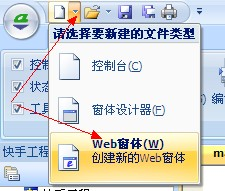

# 创建web窗体

 参考:[html](web/html)

## 什么是 web窗体

web窗体可以存取控制网页内容，并可以与网页内容进行交互，web窗体可以实现以下功能：

**1、浏览并控制网页**
使用web窗体可以显示网页，并自由读取、修改、控制网页内容。也可以在网页中使用脚本调用aardio代码。
通过web窗体，你可以使用任意网页编程方式，如javascipt,甚至flash、ActiveX。最重要的是，你不需要学习新的内容，只要会做网页就会轻松上手。 

**2、使用网页设计漂亮的图形用户界面(GUI)**
使用web窗体，你可以通过编写网页轻松实现自定义的程序界面。网页拥有比传统UI更丰富的图形展现技术,也有很多成熟的网页制作工具,使用web窗体,只要你会做网页就可以做出非常漂亮眩目的界面.而且调用aardio函数也非常方便.

## 创建 WEB应用程序


## 添加 WEB窗体



点击快速访问工具栏的第一个按钮"新建文件"右侧的下拉按钮,
在弹出的下拉菜单中点击"web窗体",创建新的web窗体.

## 编辑web窗体源代码


打开web窗体,点击"代码视图",或按Ctrl+U快捷键打开web窗体源代码.

``` aau
import win.ui;
import win.ui.menu;
import web.form;

/*DSG{{*/
var winform = win.form(parent=...; min=1
    ;bottom=249;scroll=1;text="aardio Form";right=349;max=1 )
winform.add(  )
/*}}*/

//创建web窗体
var wb = web.form( winform
	,//可输入_UIFLAG_ 前缀的常量自定义外观
	,//可输入_DLCTL_ 前缀的常量以控制下载行为
	);

//打开目标网站
wb.go("http://www.aardio.com/")
//显示窗体
winform.show(true)
wb.wait("aardio");//等待指定网址,可以使用模式匹配语法

//进入消息循环
win.loopMessage();
return wb,winform;
```

/*DSG{{*/..../*}}*/ 这中间的部分是窗体设计器生成的代码,这里生成的实际上是一个普通的windows窗体.

而web.form是一个装饰类,可以在现有窗口对象上插入网页浏览器,并返回一个浏览器对象wb.通过浏览器对象就可以控制网页、从而实现web编程.

装饰类是指的该类用于装饰被装饰的对象,以添加行为和属性.
装饰类一般并不改变对象的本质,这就好象往墙上刷涂料，无论怎么刷改变的只是外观，墙还是墙。

这里web.form用来装饰winform对象,从一个"普通的窗口"改变为"可以浏览网页的窗口",但窗口还是窗口,winform对象依然可以象普通窗口那样使用.

装饰类可以用于不同的对象,例如,你可以将winform转换为web窗口,也可以将一个普通的static文本框控件转换为web窗口.

装饰者与被装饰者是has-a关系,而不是is-a关系,在静态语言里装饰指组合关系.
而在aardio语言里,通过继承也可以实现装饰类.可以实现一些非常有趣的设计模式,例如我们常用的util.metaProperty

## web.form 构造函数

**1、函数原型：**

``` aau
//创建web窗体
var wb = web.form( 窗口对象
	,//可输入_UIFLAG_ 前缀的常量自定义外观
	,//可输入_DLCTL_ 前缀的常量以控制下载行为
	);
```

 本手册中约定使用 wb变量名表示web.form类创建的web窗体对象.使用ele表示web窗体中的元素对象,这也是aardio中默认约定具有特殊意义的变量名,不应将这些默认变量名用于其他目的.


**2、函数说明：**

web.form是一个类,其构造函数可以在现有窗口对象中插入浏览器控件.
窗口对象可以是一个win.form对象,也可以是窗体上的控件,例如static控件.

第二个参数可以使用一个或多个_UIFLAG_ 前缀的常量自定义外观,多个常量之间用位或操作符( | ) 连接.
可选参数如下:

|  字段 |  字段 |
| --- | --- |
|  _UIFLAG_DIALOG |  禁止选中文本( 用于 web ui ) |
|  _UIFLAG_SCROLL_NO |  禁用滚动条 |
|  _UIFLAG_NO3DBORDER |  禁用所有窗口3D边框 |
|  _FLAG_NO3DOUTERBORDER |  禁用顶层窗口3D边框 |
|  _UIFLAG_DISABLE_HELP_MENU |  在菜单中移除帮助菜单 |
|  _UIFLAG_DISABLE_SCRIPT_INACTIVE |  窗口激活以前不运行网页脚本 |
|  _UIFLAG_OPENNEWWIN |  在新窗口打开链接 |
|  _UIFLAG_FLAT_SCROLLBAR |  显示平面滚动条 |
|  _UIFLAG_ACTIVATE_CLIENTHIT_ONLY |  仅在用户点击客户区时激活(非客户区指滚动条等位置) |
|  _UIFLAG_URL_ENCODING_DISABLE_UTF8 |  禁用UTF8发送URL |
|  _UIFLAG_URL_ENCODING_ENABLE_UTF8 |  使用UTF8发送URL |
|  _UIFLAG_ENABLE_FORMS_AUTOCOMPLETE |  允许表单自动完成 |
|  _UIFLAG_ENABLE_INPLACE_NAVIGATION |  在点击邮件等链接时，打开相关应用程序，而不是新开窗口 |
|  _UIFLAG_NOTHEME |  使用主题 |
|  _UIFLAG_THEME |  禁用主题 |
|  _UIFLAG_NOPICS |  禁用内容分级 |
|  _UIFLAG_DIV_BLOCKDEFAULT |  编辑模式回车输入div |
|  _UIFLAG_DISABLE_EDIT_NS_FIXUP |  编辑模式禁用名字空间修正 |
|  _UIFLAG_LOCAL_MACHINE_ACCESS_CHECK |  防止远程网页导航到本地计算机 |
|  _UIFLAG_DISABLE_UNTRUSTEDPROTOCOL |  禁止非信任协议,包含 ms-its, ms-itss, its,mk:@msitstore |

第三个参数可使用_DLCTL_前缀的常量以控制下载行为,多个常量之间用位或操作符( | ) 连接.

可选参数如下:

|  字段 |  字段 |
| --- | --- |
|  _DLCTL_DLIMAGES |  允许从服务器下载图片,如果指定了第三个参数,未指定此标志,则网页不下载任何图片. |
|  _DLCTL_VIDEOS |  允许从服务器下载视频片断,如果指定了第三个参数,未指定此标志,则网页不下载任何视频片断. |
|  _DLCTL_BGSOUNDS |  允许播放文档指定的背景声音 |
|  _DLCTL_NO_SCRIPTS | web窗体不执行任何页面脚本(指javascript等) |
|  _DLCTL_NO_JAVA | web窗体不执行任何 Java applet |
|  _DLCTL_NO_RUNACTIVEXCTLS | web窗体不执行文档中的任何 ActiveX 控件； |
|  _DLCTL_NO_DLACTIVEXCTLS | web窗体不下载文档中的任何 ActiveX 控件； |
|  _DLCTL_DOWNLOADONLY | web窗体下载网页,但不显示 |
|  _DLCTL_NO_FRAMEDOWNLOAD | web窗体对包含框架的页面进行语法分析但不下载任何帧， 同时忽略框架， |
|  _DLCTL_RESYNCHRONIZE | web窗体忽略缓存中的数据并向服务器请求更新 |
|  _DLCTL_PRAGMA_NO_CACHE |  迫使请求发送给服务器并忽略代理(这里一般指服务端缓存)，即使代理指明数据是最新的也是如此. |
|  _DLCTL_NO_METACHARSET |  隐藏文档中的 META 元素指示的字符集； |
|  _DLCTL_URL_ENCODING_DISABLE_UTF8 |  禁止 UTF-8 编码 |
|  _DLCTL_URL_ENCODING_ENABLE_UTF8 |  允许 UTF-8 编码 |
|  _DLCTL_NOFRAMES |  禁止框架 |
|  _DLCTL_FORCEOFFLINE | web窗体工作在脱机方式 |
|  _DLCTL_NO_CLIENTPULL | web窗体不执行任何客户端的 pull 操作 |
|  _DLCTL_SILENT |  组件对话框、脚本错误对话框静默模式 |
|  _DLCTL_OFFLINEIFNOTCONNECTED |  如果未连接互联网，浏览器组件将以脱机方式工作 |

在我们制作web机器人时，可能不希望网页执行脚本、弹出很多对话框或网页、或者不希望下载多余的文件,那
么这个参数会很有用.

在『』开发环境中输入常量前缀时,会自动提示相关常量,选
择常量,然后回车即可输入常量数值,如下:


**3、调用示例：**

``` aau
//创建web窗体
var wb = web.form( winform.static //这是winform窗体上的一个静态文本框控件
	,0x4/*_UIFLAG_NO3DBORDER*/ | 0x8/*_UIFLAG_SCROLL_NO*/  //禁用边框,禁用滚动条
	,0x10/*_DLCTL_DLIMAGES*/ | 0x40000000/*_DLCTL_SILENT*/  //允许下载图片,但是禁用组件对话框、脚本错误对话框等
	);
```
