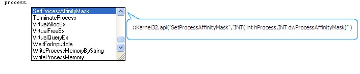

# process库

process库提供进程管理函数

## 进程

### 1、什么是进程

进程(process)是指一个正在执行的程序,一个计算机中的可执行exe文件在运行后创建的程序实例.
进程是由进程控制块、程序段、数据段组成。一个进程可以包含若干线程(Thread)，线程可以并发执行.


### 2、进程ID

进程被创建时，系统会赋给它一个唯一的标识符，就是进程ID。系统中运行的其他进程不会有相同的ID值，这个值也是可以被使用的，例如父进程可以通过创建子进程时得到的ID来和子进程通信。


### 3、进程句柄

进程对象是一种内核对象，每个内核对象实际上是由内核分配的一块内存，而且只能由内核来访问。这一内存块是一个数据结构，它的成员包含有关于该对象的信息。当调用创建内核对象的函数时，函数返回一个标志该对象的句柄，它是一个32位的数值，可以被进程中的任意线程使用，可以把它传给各种WIN32函数，这样系统就知道想要操纵的是哪一个内核对象.


### 4、进程控制对象

aardio的process库提供process类可以创建进制控制对象.可以启动进程或打开现有进程,获取进程内核对象的句柄,并提供一系列管理、控制目标进程的函数

## 创建进程控制对象

**1、函数原型：**

``` aau
//创建当前进程控制对象
prcs = process()

//使用已运行的进程ID创建进程控制对
prcs = process( 进程ID )

//运行执行文件,创建新的进程,并返进程控制对象
prcs = process( "exe执行文件路径",启动参数 = "", 是否创建为休眠状态=false,工作目录=exe目录 )
```


**2、函数说明：**

process是一个类,用于创建进程控制对象.
而process类的构造函数支持动态的参数,有三种用法.

> 1)、无参数,打开当前进程
2)、使用进程ID作为参数 参考:each
3)、使用exe文件路径作为参数,并可选指定启动参数,可选指定是否创建为休眠状态,可选指定工作目录.
参数如果不是以"\"或"/"开头的根目录下的路径,则必须是一个绝对路径.当进程创建为休眠状态时,进程创建后并不运行,此时可以读写内存,

**3、调用示例：**


``` aau
//导入要用到的库
import fsys
import process;

//创建进程管理对象,注意这里必须要是绝对路径
var prcs = process( fsys.getSysDir() ++ "\notepad.exe","",true /*启动后停止运行*/ )

//读写内存
var n = prcs.readNumber( 0x101d1,"word" ) ;  //读内存word类型数值
prcs.writeNumber(0x101d1,n,"word") //写入内存word类型数值

thread.resume( prcs.thandle ) //继续执行线程
```

 在本文档中,使用 prcs表示process类构造的对象

## 进程控制对象属性

**1、属性说明：**


`prcs.id` 表示进程ID

`prcs.handle` 表示进程句柄

`prcs.tid` 表示线程ID

`prcs.thandle` 表示线程句柄

**2、属性示例：**

``` aau
import process;

//打开控制台
io.open()

//创建进程控制对象
var prcs = process( fsys.getSysDir() ++ "\notepad.exe"  ) //注意这里必须要是绝对路径

//显示属性
io.print("进程ID",prcs.id )
io.print("进程句柄",prcs.handle )
io.print("主线程ID",prcs.tid )
io.print("主线程句柄",prcs.thandle )
```

## prcs.free()

**1、函数原型：**

``` aau
prcs.free()
```


**2、函数说明：**

关闭进程控制对象.
请注意关闭的是用来控制目标进程的内核对象,并非关闭目标进程(停止运行)

## prcs.terminate()

**1、函数原型：**

``` aau
prcs.terminate()
```


**2、函数说明：**

强制杀除目标进程,使之停止运行.
这是暴力中断进程,不宜太多使用,因为目标进程可能没有机会去做退出时释放资源保存数据的操作.
如果是窗口程序,可对主窗口发送_WM_CLOSE消息使之正常关闭退出.

**3、调用示例：**


``` aau
import process;
import fsys;

//打开控制台
io.open()

//创建进程控制对象
var prcs = process( fsys.getSysDir() ++ "\notepad.exe"  ) //注意这里必须要是绝对路径

sleep(1000)

//杀除进程
prcs.terminate()
```

## prcs.readNumber

**1、函数原型：**

``` aau
num =  prcs.readNumber ( 目标进程内存地址,"静态数据类型" )
```


**2、函数说明：**

自目标进程的指定内存地址,读取指定类型据类型的数字值.请参考:[静态数据类型](libraries/kernel/raw/datatype)

可选的类型有:"int" "byte","word","long"以及无符号数值数据"INT","BYTE","WORD","LONG"

## prcs.writeNumber

**1、函数原型：**

``` aau
prcs.writeNumber ( 目标进程内存地址,要写入的数值,"静态数据类型" )
```


**2、函数说明：**

向目标进程的指定内存地址,写入指定类型据类型的数字值.请参考:[静态数据类型](libraries/kernel/raw/datatype)

可选的类型有:"int" "byte","word","long"以及无符号数值数据"INT","BYTE","WORD","LONG"

**2、调用示例：**

``` aau
import process;
import fsys;

//创建进程控制对象
var prcs = process( fsys.getSysDir() ++ "\notepad.exe"  ) //注意这里必须要是绝对路径

n = prcs.readNumber( 0x101d1,"word" );  //读内存word类型数值
prcs.writeNumber(0x101d1,n,"word");  //写入内存word类型数值
```

## prcs.readString

**1、函数原型：**

``` aau
prcs.readString(目标进程内存地址,要读取的字符串长度)
```


**2、函数说明：**

自目标进程的指定内存地址,读取指定长度的字符串值.

## prcs.writeString

**1、函数原型：**

``` aau
prcs.writeString(目标进程内存地址,要写入的字符串)
```


**2、函数说明：**

向目标进程的指定内存地址,写入指定长度的字符串值.

## prcs.readStruct

**1、函数原型：**

``` aau
num =  prcs.readStruct ( 目标进程内存地址,静态结构体 )
```


**2、函数说明：**

自目标进程的指定内存地址,读取自定义的struct结构体.请参考:[静态数据类型](libraries/kernel/raw/datatype)

## prcs.malloc

**1、函数原型：**

``` aau
addr = prcs.malloc ( 要分配的内存长度,访问类型,分配类型 )
```


**2、函数说明：**

在目标进程分配内存,分配类型与访问类型可省略.此函数分配的内存默认可读写、可执行.可以用于写入机器码等. 也可以显示指定分配类型与访问类型(一般无此必要),.访问类型为_PAGE_前缀的常量,而分配类型为_MEM_前缀的常量.

在『』开发环境中输入该前缀可自动显示相关常量,如下:


## prcs.mfree

**1、函数原型：**

``` aau
prcs.mfree( 内存地址,释放长度=0,释放类型=0x8000 )
```


**2、函数说明：**

该函数用于释放prcs.malloc分配的内存地址.
请注意此函数名字为memery free的缩写,首字母m表示memery(内存),注意与prcs.free()区别.

第二个参数,第三个参数通常不需要指定.
如果将第三个参数指定为:0x4000,则仅仅释放指定长度的内存,这种方式释放不彻底,内存页还将存在,因此一般不应显式指定第二个参数以及第三个参数.

## prcs.remoteApi

**1、函数原型：**

``` aau
func_call = prcs.remoteApi( 函数原型, 这里是函数地址,调用约定="stdcall" )
func_call = prcs.remoteApi( 函数原型, DLL文件名,函数名字,调用约定="stdcall" )
```


**2、函数说明：**

该函数内部实际上是调用raw.remoteApi,
所有参数用法与raw.remoteApi相同.唯一的区别是不需要使用进程ID参数.

请参考: [raw.remoteApi](libraries/kernel/raw/call)

使用process库启动的进程对象可以获取更高的权限,因此推荐使用prcs.remoteApi来代替raw.remoteApi.

## prcs.query

**1、函数原型：**

``` aau
内存块基址,块长度,字符串,字符串开始位置,字符串结束位置,模式串,访问保护类型,分配类型
               = prcs.query( 内存地址,最大地址,搜索数据,保护类型,分配类型  )
```


**2、函数说明：**

该函数根据提供的内存地址,查询内存块信息,如果不指定任何参数,返回第一个可用的内存块信息.
所有参数都是可选参数,搜索数据可以是一个使用模式语法的字符串，也可以是一个结构体(自动生成二进制搜索模式串，首字符为'@')访问保护类型为_PAGE_前缀的常量(可选参数，默认值为 0x4/*_PAGE_READWRITE*/ ),而分配类型为_MEM_前缀的常量.最小地址与最大地址如果不指定,函数会自动获取进程的最小地址与最大地址.
prcs.query() 内部调用 prsc.eachQuery() ，这两个函数参数相同，prsc.eachQuery() 创建的迭代器用于forin语句，迭代器的返回值与 prcs.query() 相同。

**2、调用示例：**

``` aau
//QQ2010~2013通用登录号码内存搜索示例
import process
import console;

//这个表用来保存QQ号,并排除重复的QQ号
var qqtable = {};

//遍历所有进程
for processEntry in process.each( "QQ\.exe" ) {

    console.log("发现QQ进程,正在搜索进程......")
    prcs = process( processEntry.th32ProcessID )

    for( addr,len,str,i,j,pattern,protect,mtype
        in prcs.eachQuery( ,,"\d\d{4,12}[\\&][QAcu]" ) ){
        qq = string.match( str,"(\d{5,12})\\QQ\\Wintemp")
        qq := string.match( str,"(\d{5,12})\&ADSESSION")
        qq := string.match( str,"(\d{5,12})\&clientkey")
        qq := string.match( str,"(\d{5,12})\&utype\=")
        if( qq ){
            qqtable[qq] = true;
            console.log( qq )
        };
    }

    //关闭对象
    prcs.free();
}

console.log("发现以下QQ号已登录")

for(qq in qqtable){
    console.log( qq )
}
```

## process.execute

**1、函数原型：**

``` aau
process.execute( EXE文件路径, 启动参数="",操作类型 = "open",显示属性
    ,工作目录="",调用窗口句柄=0  )
```


**2、函数说明：**

运行EXE程序,除第一个参数以外,其他参数可选.
支持"/"或"\"开头的根目录下的相对路径,支持系统目录下的相对路径.
此函数与windows开始菜单里的"运行"功能类似,在"开始菜单->运行"中可以输入的指令,在这里也可以直接输入.

第三个参数:可选的操作类型:

类型 | 说明
- | -
"edit" | 打开编辑器编辑文档，如果 lpFile 不是一个文档，则这个函数会失败
"explore" | 以 lpFile 为路径打开资源管理器
"find" | 从指定目录开始搜索
"open" | 根据 lpFile   打开对应文件，该文件可以为可执行文件、文档或者文件夹
"print" | 根据 lpFile   打印文档，若lpFile不是一个文档则该函数会失败
"properties" | 显示文件或文件夹的属性

第四个参数:显示属性使用_SW_开头的数字常量,在快后开发环境中输入会自动提示可用的常量,
例如 `0x0/*_SW_HIDE*/` 表示隐藏窗口。

**3、调用示例**

``` aau
import process
import fsys;

//直接运行,系统程序可以使用相对路径
process.execute(  "Explorer.exe"," /select," + fsys.getExeFile() )
```

## process.execute_wait

**1、函数原型：**

``` aau
process.execute_wait( EXE文件路径, 启动参数="",操作类型 = "open",显示属性
    ,工作目录="",调用窗口句柄=0  )
```


**2、函数说明：**

此函数与 process.execute用法完全相同,唯一的区别是会等待目标程序关闭再返回.

## process.explore_select

**1、函数原型：**

``` aau
process.explore_select( 文件路径  )
```


**2、函数说明：**

打开资源管理器,并选定该文件.

**3、调用示例：**

打开资源管理器,并选定该文件.

``` aau
import process
import com.picture;

var pic = com.picture.snap()//抓屏
pic.Save( "/抓屏.jpg" )

//打开浏览器,选定该文件
process.explore_select("/抓屏.jpg")
```

## process.kill

**1、函数原型：**

``` aau
process.kill( exe文件名 )
```


**2、函数说明：**

根据exe文件名杀除进程

**2、调用示例：**


``` aau
import process

//关闭所有记事本进程
process.kill( "Notepad.exe" )
```

## process.each

**1、函数原型：**

``` aau
for processEntry in process.each( exe文件名 ) {

}
```

**2、函数说明：**

迭代遍历所有运行进程,参数为exe文件名,支持:[模式查找语法](libraries/kernel/string/pattern%20syntax)

请参考:[枚举与迭代的区别](the%20language/enum_each) [for...in语句](the%20language/statements/looping#forin)

**2、调用示例：**

``` aau
import process

io.open()
for processEntry in process.each( ".*.exe" ) {
	io.print("进程ID",processEntry.th32ProcessID)
	io.print("进程文件名", processEntry.szExeFile  )
}
```

## 其他在process库定义的API函数

根据aardio标准规范,非win库函数应将WINAPI定义在各自的名字空间,而不应使用::前缀.
请参考:[win库,关于::操作符的使用约定](libraries/std/win)

process在process名字空间定义了与进程有关的常用API,在开发环境中输入process.前缀即显示所有定义的API函数、结构体等.



如果你需要使用与进程有关的WINAPI函数,请首先输入process.前缀查找此函数名字是否已定义,避免重复的声明相同的API函数.
